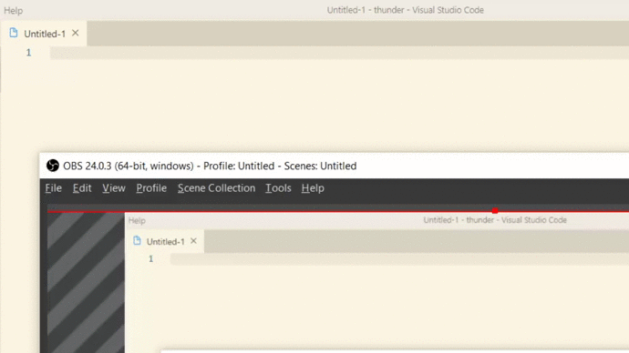

*** 
##  Gracias por descargar y bienvenido a Thunder!
*** 


  
  Crear estructuras LWC para tus componentes de Salesforce usando el comando  

```
lwc-yourCommand
```
#### Example


**Nota:** Thunder esta en su versión Beta, espero que lo disfrutes.
***  
## 📋 Requerimientos 

* [(SFDX CLI) Instala - Aquí](https://developer.salesforce.com/tools/sfdxcli)  
* [(SalesForce Extension Pack) Instala - Aquí](https://marketplace.visualstudio.com/items?itemName=salesforce.salesforcedx-vscode)

*** 
## Problemas conocidos

- No registrados
*** 


## 🔧 Notas de la versión 
**Nuevo**
### 1.0.0
- Apex (lwc-apex)
- Batch (lwc-init, lwc-install)

*** 


## Comandos

## |APEX|
```
lwc-apex --> Clase que se puede exponer hacia lwc, recuerde usar lwc-callApex en un componente JS
```

## |BATCH|
```
lwc-install --> Instala servidor de pruebas LWC
lwc-init --> Inicia el servidor de pruebas LWC
```

## |HTML|
```
lwc-onchange --> Permite disparar un evento en etiquetas </lightning-input>
lwc-repeat --> Permite repetir un arreglo dentro de una plantilla del tipo </template>
lwc-if --> Oculta o no un elemento del DOM con la etiqueta if
lwc-callson --> Puede utilizar una directiva hijo, pasando valores por sus atributos y usando la plantilla html de la directiva
```

## |JS|
```
lwc-bind --> (@track - For Array and Binding), (@api get access external call from parent)
lwc-catchEvent --> (Handle tracker) listener event of var
lwc-init --> (Life Hooks) - Se ejecuta cuando el componente es insertado al DOM
lwc-delete --> (Life Hooks) - Se ejecuta cuando el componente es eliminado del DOM
lwc-timeout --> Acción sincrona, pausa el proceso durante un tiempo
lwc-obj --> Arreglo de objetos
lwc-dataExport --> Exporta un conjunto de datos
lwc-setter --> Genera un get y set api de componente hijo disponible para consumir con *callson* desde padre
lwc-getRecord --> Obtiene valores de los campos del registro desde la pagina en donde es ubicado el componente
lwc-callApex --> Permite llamar un apex con o sin parametros
```

## |XML| _only lwc, no Apex_
```
lwc-xml --> (XML Base) General configs for xml base
lwc-tag --> (Add access LWC for different pages) Records in AppPage,RecordPage and others parts
```

*** 
## Example
```
lwc-init
```
